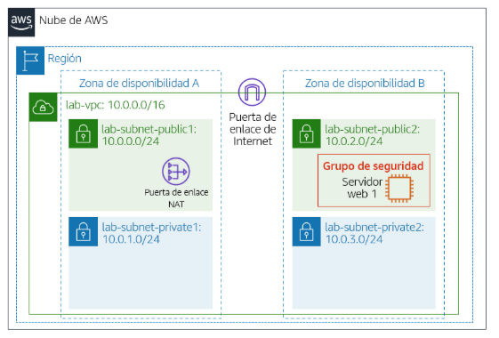

# Infraestructura en AWS con Terraform
Este trabajo tiene como objetivo recrear el Laboratorio 2 del Módulo 5 de AWS Academy utilizando Terraform para implementar Infraestructura como Código. Se construirá una VPC personalizada, se configurará un grupo de seguridad y se desplegará una instancia de EC2 con un servidor web en una subred de la VPC, siguiendo las consignas del laboratorio original.

Debemos Implementar la siguiente infraestructura a través de Terraform.


## Clonar el repositorio.
```
git clone https://github.com/ivolato/Desafio-7-terraform.git
```

## Introducimos las credenciales que utilizara Terraform para conectarse a AWS
```
cd .aws
nano credentials
```

## Iniciamos el Proyecto de Terraform
```
cd environment/Desafio-7-terraform
terraform init
terraform plan
```

## Iniciamos la creacion de los recursos 
```
terraform apply
```

